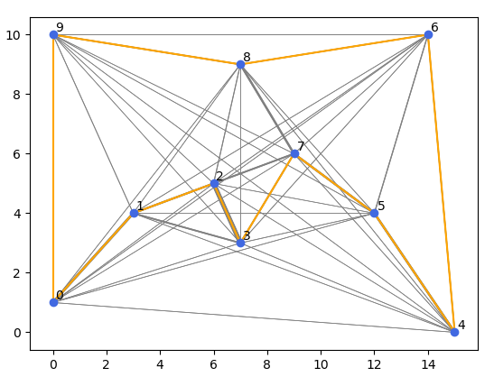

# Ant Systems <!-- omit in toc -->

- [Description](#description)
- [Travelling salesman](#travelling-salesman)
	- [Solution](#solution)

## Description

In computer science and operations research, the ant colony optimization algorithm (ACO) is a probabilistic technique for solving computational problems which can be reduced to finding good paths through graphs.

## Travelling salesman

Assumptions of problem:

1. It must visit each city exactly once;
2. A distant city has less chance of being chosen (the visibility);
3. The more intense the pheromone trail laid out on an edge between two cities, the greater the probability that that edge will be chosen;
4. Having completed its journey, the ant deposits more pheromones on all edges it traversed, if the journey is short;
5. After each iteration, trails of pheromones evaporate.


*Fig. 1 Travelling salesman problem solution (by <a href="//commons.wikimedia.org/wiki/User:Nojhan" title="User:Nojhan">Nojhan</a> - <span class="int-own-work" lang="en">Own work</span>, <a href="http://creativecommons.org/licenses/by-sa/3.0/" title="Creative Commons Attribution-Share Alike 3.0">CC BY-SA 3.0</a>, <a href="https://commons.wikimedia.org/w/index.php?curid=820846">Link</a>)*

### Solution

```txt
{'init': 2, 'path': [2, 3, 7, 5, 4, 6, 8, 9, 0, 1, 2], 'dist': 55.04410012056727}
```


*Fig. 2 Plot showing solution to travelling salesman problem from implementation (line thickness describes pheromone concentation; orange line shows the optimal path)*
